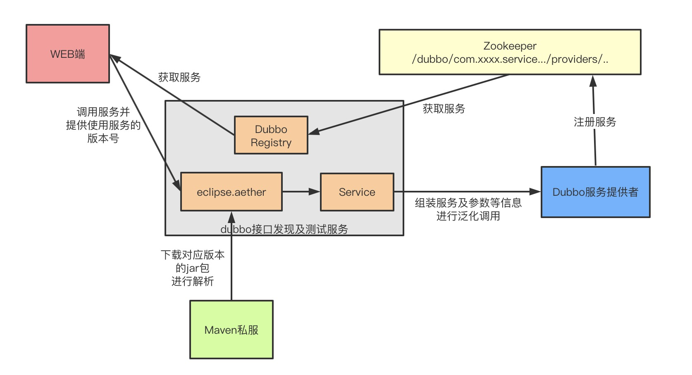

# Dubbo-TEST

## 设计



因为定位为一个工具，所以尽量不引入外部依赖，如 mysql, redis等，可以做到独立启动

## 说明
dubbo 接口测试功能（部分代码来自dubbo-admin），主要用来支持 < 2.7 版本, 2.7版本可以使用新版dubbo-admin

Dubbo2.7新版的dubbo-admin支持了接口的测试功能，主要原因是它新增加的元数据中心中含有了接口的参数类型信息
元数据中心的例子部分数据如下：

```java
{
    "parameters": {
        "side": "provider",
        "application": "demo-provider",
        "release": "2.7.4",
        "methods": "sayHello",
        "deprecated": "false",
        "dubbo": "2.0.2",
        "dynamic": "true",
        "interface": "demo.service.IDemoService",
        "generic": "false",
        "bean.name": "demo.service.IDemoService",
        "anyhost": "true"
    },
    "methods": [
        {
            "name": "sayHello",
            "parameterTypes": [
                "java.lang.String"
            ],
            "returnType": "java.lang.String"
        }
    ]
}
```
methods中有每个方法的参数和返回类型
但是对于2.7之前的版本，只能通过注册中心获取数据，其中只有方法名称，并没有方法的参数类型信息

同时发起dubbo调用必须明确指定参数类型，如果引用了api的包，那么调用时肯定是可以拿到参数类型的，
如果使用泛化调用，则需要用户手动执行参数的类型和值，或者让程序下载对应的Jar包自己进行解析处理

